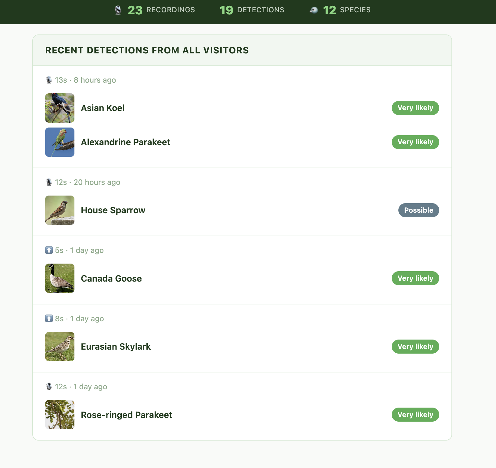

# BirdLens
Browser-based bird sound detection powered by BirdNET-Analyzer.
Record or upload a clip → identify species instantly.

**Live demo:** https://birdlens.vercel.app


 

## What it does
Record audio from your browser mic or upload a clip (max 30s).
BirdLens identifies bird species present in the audio and returns
each detection with a photograph, confidence score, and fun fact.
Every run contributes to a shared global feed visible to all visitors.

## Architecture
- Frontend: React (Vite) → Vercel
- Backend: FastAPI + BirdNET-Analyzer → Hugging Face Spaces
- Database: Supabase (PostgreSQL)
- Bird images: Wikipedia API
- Species info: iNaturalist API

## Local Development

Backend:
```bash
cd backend
cp .env.example .env  # add your Supabase credentials
pip3 install -r requirements.txt
python3 -m uvicorn app.main:app --reload
```

Frontend:
```bash
cd frontend
cp .env.example .env  # set VITE_API_BASE_URL=http://localhost:8000
npm install
npm run dev
```

## Product Decisions
See `docs/PRD.md` for full specification and decision log.

## Roadmap
See `docs/PRD.md` → Section 14

## Attribution
Built on BirdNET-Analyzer by the K. Lisa Yang Center for Conservation Bioacoustics, Cornell Lab of Ornithology.
BirdNET models: CC BY-NC-SA 4.0 (non-commercial use).
